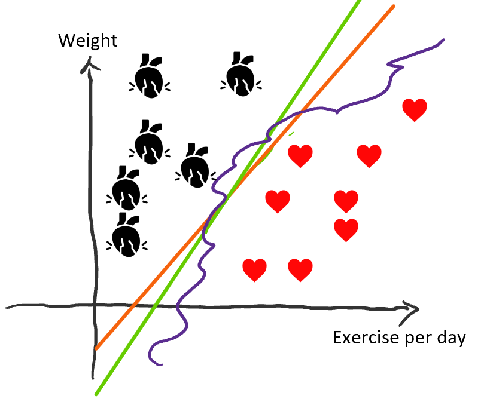

# Classification

## Introduction

* Classification aims to optimize a mathematical rule, aka model, that provides the category to which an instance belongs using a set of given examples \(see Section [supervised and unsupervised](../introduction.md#sec:supervisedvsunsupervised) and [supervised model](../introduction.md#sec:supervisedmodels)\). An example of a classification problem is: given characteristics of a person, such as smoking habits, history of a heart attack in the family, number of hours of exercise per day, height, weight, among others, whether the person going to have a heart attack after their 50's \(yes/no\). Another example of a classification problem is to find the type of a tumor \(benign, type 1, type 2, or type 3\) given its characteristics \(e.g., shape, color, genetic information, history of the patient, among others\). 
* As the training data-set is a subset of all possible data points, any model, in any shape and form, that separates the given instances and optimizes the evaluation measure is acceptable \(purple, green, and orange lines in the Fig. Take me to \[my figure\]\(\#\)\).
* Because of this incomplete knowledge, some assumptions need to be made to ensure that the "optimized" model performs well not only on the training data-set but also on unseen instances \(generalization ability\). This means defining "the best model", a model that not only separates the given instances but also all other unseen instances, is limited by the knowledge encoded in the training set. 
* These assumptions include the shapes of the mathematical rule \(a line, "if-then" rules, etc.\) and the _evaluation_ metric by which the rule is evaluated.
* Different classification methods usually differ by their assumptions on the model, evaluation metric, and optimization method used.

|    |    |
| :--- | :--- |
|  |  |

  

To design a classifier, one would need the training data, the model \(e.g., linear\), an evaluation metric \(e.g., maximum empirical margin in support vector machines\), and an optimization algorithm to optimize the model parameters given the evaluation metric and the data. The evaluation metric is responsible to inform the optimizer on how well the current parameters perform while ensure the generalization ability is not sacrificed.

## Generative vs. discriminative classifiers

See [Nguyan and Jordan](https://ai.stanford.edu/~ang/papers/nips01-discriminativegenerative.pdf) article for a formal definition of discriminative classification.

_\*\*\*\*_

