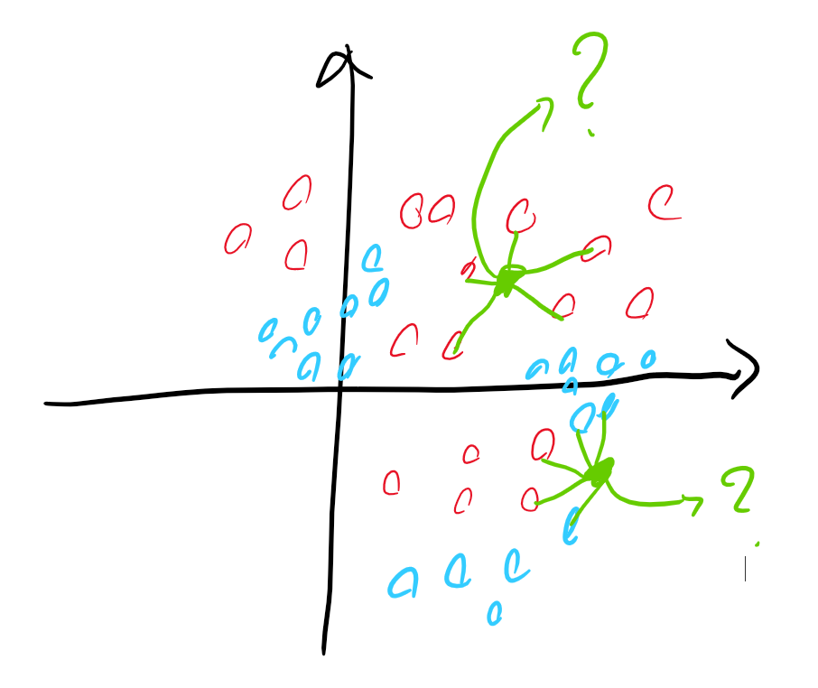
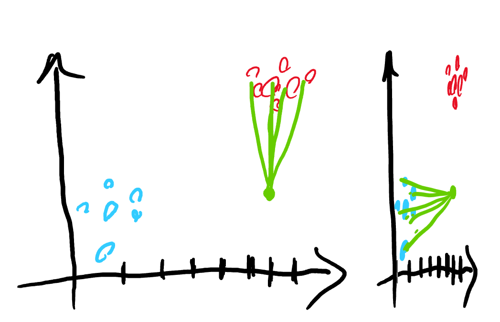

# K-nearest neighbor

### Introduction

The k-nearest neighbor \(KNN\) classifier assumes that the instances "close" to one another have the same class label. Hence, to assign a class label to a new instance, KNN finds $k$ instances from the training data set to which the new instance is "closest" and use those labels to vote for the class label of the new instance.

The "closeness" is defined by a distance measure, such as Euclidean distance.

### Improvements

In KNN, some attributes may lead to a biased distance. For example, if one of the attributes is in the order of 1,000 and another is in the order of 0.1, the latter would have a small impact on the calculation of the distance. This is usually resolved by standardizing the variables, which ensures all attributes are in the same range. This method, however, may break some structural integrity of the instances.

Another issue is that some attributes might be misleading and their impact is better to be reduced. For example, Fig. below indicates that the horizontal dimension is responsible for the green instance to be of the type "red". This, however, may not be correct as if the horizontal dimension shrinks then the green instance becomes closer to blue instances, which makes it a blue class from KNN perspective.

This indeed leads to an in-accuracy in KNN; the algorithm does not take into account the importance of attributes. This can be addressed by optimizing a metric which shrinks/contracts the space along different attributes to achieve the best transformation in which KNN performs best. See Section @ref \@ref\(sec:metricslearning\) for details.

### Pros and cons

_Pros_:

* It is easy to implement.
* It can model non-linearity.
* The assumption behind KNN is not parametric and only depends on the given data.

_Cons_:

* Requires storage of the training data. This can be reduced as proposed by \[???\]
* The closeness needs to be defined. Euclidean distance is an obvious choice, however, it is not always optimal \[????\].
* Requires searching for the closest instances in the training set, which is slow. This can be resolved by using smart search methods \[????\]
* Some of the dimensions may lead to biasing the distance
* KNN does not provide any information about the importance of attributes. This, however, is resolved by optimizing a metric to transform the space to represent the training data optimally \(see section \@ref\(sec:metricslearning\)\)

### Implementation

* It is available with sklearn in Python
* 
