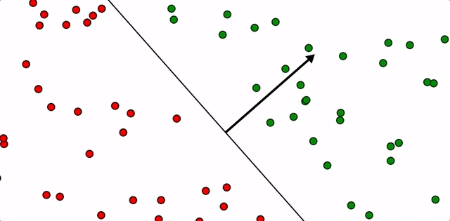

# Support vector machine

### What that is

* Consider a binary classification problem and assume we want to optimize a hyperplane \(linear model\) to separate the classes. 
* There might be many hyperplanes which separate the classes, all of which would result in the same mis-classification error. This encourages design of constraints which narrow down acceptable hyperplanes. 

* One reasonable constraint is to pick the hyperplane which has maximum distance from the instances from both classes. This idea forms the bases for the support vector machine \(SVM\). 

* It is expected that SVM works better than Logistic Regression on the unseen instances as it minimizes the empirical risk. This, however, is not always true as the assumption behind SVM might not be always true and it is bound by the quality of the training data. 

See [wikipedia](https://en.wikipedia.org/wiki/Support-vector_machine#Linear_SVM) for more details on how this is formulated by the hinge loss and how it can be solved by gradient descent. See also [this](https://jeremykun.com/2017/06/05/formulating-the-support-vector-machine-optimization-problem/) which describes SVM nicely.

### Improvements

* **Linear program SVM**: While SVM aims can be formulated as a quadratic program, it can also be formulated by a linear program. See [this paper](http://citeseerx.ist.psu.edu/viewdoc/download?doi=10.1.1.332.7187&rep=rep1&type=pdf) for details.
* **Dimensionality reduction SVM**: The usual dimensionality reduction technique in supervised learning is mainly based on linear discriminant analysis \(LDA\), but it suffers from singularity or undersampled problems. On the other hand, a regular support vector machine \(SVM\) separates the data only in terms of one single direction of maximum margin, and the classification accuracy may be not good enough. SVM can be used to generate orthogonal directions that best separate the data with the maximum margin are obtained. See [this paper](https://ieeexplore.ieee.org/document/4378279).
* **Twin SVM**: Is a more recent variant of SVM, is very powerful \(much better and faster than SVM\), see [paper here](https://ieeexplore.ieee.org/document/4135685). See an implementation [here](https://github.com/AK101111/Twin-SVM). It essentially fits a generative model to each class, making sure the generative models are as distinct as possible, and then use those models for classification.
* **One-class SVM**: is also used for anomaly/outlier/novelty detection. See ???? ~~_**\#\#TOCOMPLETE**_~~.
* **Kernel SVM**: SVM can be extended to provide non-linear hyperplanes to seperate the classes. This can be done by adding Kernel \(see [kernel trick](https://en.wikipedia.org/wiki/Kernel_method) and [representer theorem](https://en.wikipedia.org/wiki/Representer_theorem)\) to the algorithm. See [wikipedia](https://en.wikipedia.org/wiki/Support-vector_machine#Linear_SVM) for how.

### Interpretability

* Similar to Logistic Regression, absolute value of coefficients of linear SVM provide variable importance only if the variables values have been standardized.
* L1 regularization in SVM can be used for "feature selection".
* Watch out for population effect \(see [this paper](http://www.maths.usyd.edu.au/u/pengyi/publication/Yang_et_al_stability.pdf)\) when using for feature selection ~~_**\#\#TOCOMPLETE**_~~

### Implementation

* See ??? for implementation from scratch ~~_**\#\#TOCOMPLETE**_~~.
* It is also available with [sklearn](https://scikit-learn.org/stable/modules/generated/sklearn.svm.SVC.html) in Python.

