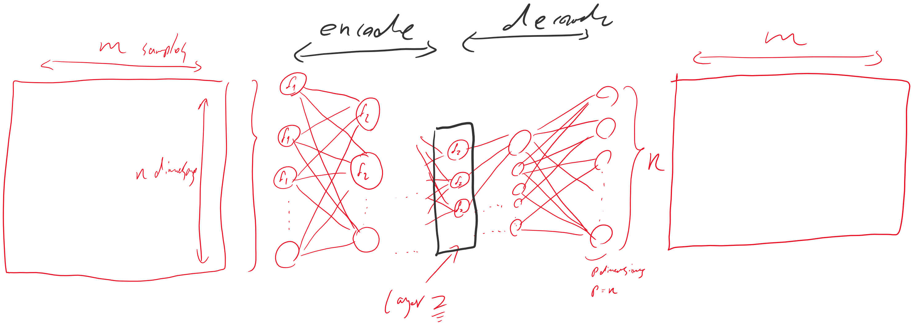

# Autoencoder

PCA’s objective is to find an invertible transformation from the original space of the data to a lower-dimensional space. In its original form, PCA seeks a linear transformation for this, however, it can be kernalized to enable the search for non-linear transformations. Autoencoder generalizes this idea, seeking a transformation \(not necessarily linear\) from original transformation to a lower-dimensional space \(encoder\) and another transformation that inverses the encoder \(called decoder\).

Autoencoders are a type of deep neural networks that map the data to itself through a process of \(non-linear\) dimensionality reduction, followed by dimensionality expansion. Given X as an m by n matrix \(m samples and n dimensions\), M_i an n\_i by n_{i+1} dimensional matrix, f_i a function R^{n_{i+1}} \to R^{n\_{i+1}}, an autoencoder maps the samples by f\_p\(…f\_3\(f\_2\(f\_1\(XM\_1\)M\_2\)M\_3\)…M\_p\) etc., where p being the size of the last matrix, and it is equal to n. Usually, some middle layers have smaller number of dimensions than n \(i.e., there exists an z where $n\_z&lt;&lt;n$\). The set of layers before z encode the information into n\_i dimensions, while the layers after that decode the information back. The aim is to find the best values in M\_is so that the, for each sample, the encoded and then decoded is the same. That means each sample is mapped to itself. Once optimized, the layer z embeds information in the n dimensions.

Autoencoders can be used for dimensionality reduction \(detach the decoder, all n-dimensional samples are encoded into z dimensions\) and anomaly detection \(normal samples are mapped back to themselves with less error comparing to abnormal instances\).

